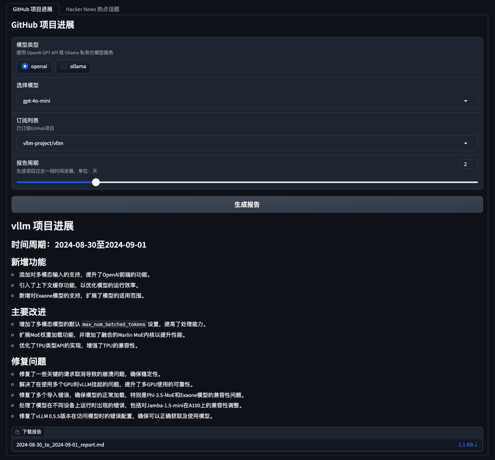
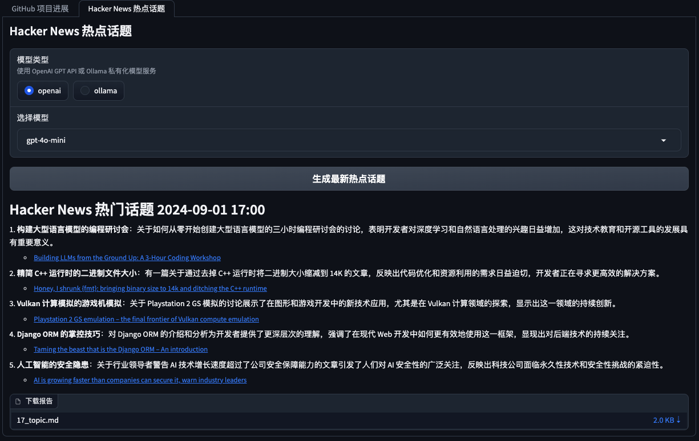
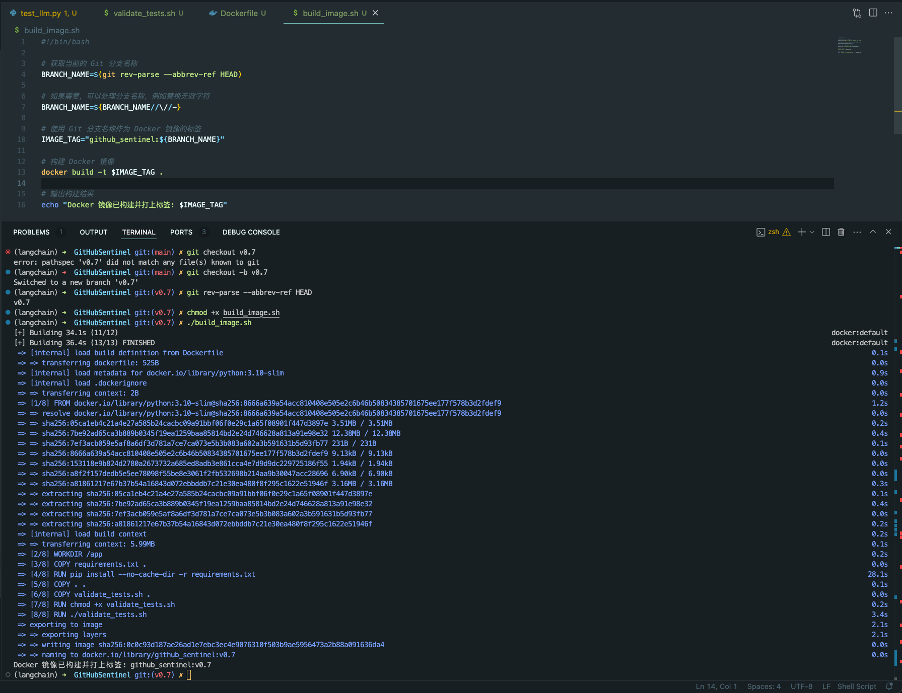

# GitHub Sentinel


<p align="center">
    <br> <a href="README.md">中文</a> | English
</p>

## Table of Contents

- [GitHub Sentinel](#github-sentinel)
- [Key Features](#key-features)
- [Product Screenshot](#product-screenshot)
- [Quick Start](#quick-start)
  - [1. Install Dependencies](#1-install-dependencies)
  - [2. Configure the Application](#2-configure-the-application)
  - [3. How to Run](#3-how-to-run)
    - [A. Run as a Command Line Tool](#a-run-as-a-command-line-tool)
    - [B. Run as a Background Service](#b-run-as-a-background-service)
    - [C. Run as a Gradio Server](#c-run-as-a-gradio-server)
- [Ollama Installation and Service Deployment](#ollama-installation-and-service-deployment)
- [Unit Testing](#unit-testing)
  - [Unit Testing and Validation Script `validate_tests.sh`](#unit-testing-and-validation-script-validate_testssh)
    - [Purpose](#purpose)
    - [Functionality](#functionality)
- [Building and Validating with Docker](#building-and-validating-with-docker)
  - [1. `Dockerfile`](#1-dockerfile)
    - [Purpose](#purpose)
    - [Key Steps](#key-steps)
  - [2. `build_image.sh`](#2-build_imagesh)
    - [Purpose](#purpose)
    - [Functionality](#functionality)
- [Contributing](#contributing)
- [License](#license)
- [Contact](#contact)


GitHub Sentinel is an `AI Agent` designed for the era of large language models (LLMs), specializing in intelligent information retrieval and high-value content extraction. It is tailored for users with high-frequency and large-scale information needs, such as open-source enthusiasts, individual developers, and investors.

### Key Features

- **Subscription Management**: Easily manage and track your subscribed GitHub repositories.
- **Update Retrieval**: Automatically fetch and aggregate the latest updates from your subscribed repositories, including commits, issues, and pull requests.
- **Notification System**: Receive real-time notifications via email about the latest project progress.
- **Report Generation**: Generate detailed project progress reports based on the retrieved updates, supporting various formats and templates to meet different needs.
- **Multi-Model Support**: Leverage OpenAI and Ollama models to generate natural language project reports, offering more intelligent and accurate information services.
- **Scheduled Tasks**: Supports scheduled tasks running as a daemon process, ensuring timely retrieval of updates.
- **Graphical Interface**: Provides a simple and user-friendly GUI based on Gradio, making it accessible to a wider audience.
- **Containerization**: The project supports Docker build and containerized deployment, allowing quick and easy setup in different environments.
- **Continuous Integration**: Comprehensive unit tests are implemented, facilitating the configuration of production-level CI/CD pipelines to ensure project stability and high-quality delivery.

GitHub Sentinel not only helps users automatically track and analyze the progress of `GitHub open-source projects` but also extends its capabilities to other information sources, such as trending topics on `Hacker News`, providing a more comprehensive approach to information extraction and analysis.

### Product Screenshot

**GitHub Project Tracking and Summary**



**Hacker News Trending Tech Topic Mining**



## Quick Start

### 1. Install Dependencies

First, install the required dependencies:

```sh
pip install -r requirements.txt
```

### 2. Configure the Application

Edit the `config.json` file to set up your GitHub Token, Email settings (using Tencent WeCom Email as an example), subscription file, update settings, large model service configurations (supporting OpenAI GPT API and Ollama private large model service) and report types autogenerated by LLMs:

```json
{
    "github": {
        "token": "your_github_token",
        "subscriptions_file": "subscriptions.json",
        "progress_frequency_days": 1,
        "progress_execution_time": "08:00"
    },
    "email":  {
        "smtp_server": "smtp.exmail.qq.com",
        "smtp_port": 465,
        "from": "from_email@example.com",
        "password": "your_email_password",
        "to": "to_email@example.com"
    },
    "llm": {
        "model_type": "ollama",
        "openai_model_name": "gpt-4o-mini",
        "ollama_model_name": "llama3",
        "ollama_api_url": "http://localhost:11434/api/chat"
    },
    "report_types": [
        "github",
        "hacker_news_hours_topic",
        "hacker_news_daily_report"
    ],
    "slack": {
        "webhook_url": "your_slack_webhook_url"
    }
}
```

**For security reasons:** The GitHub Token and Email Password settings support using environment variables to avoid configuring sensitive information in plain text, as shown below:

```shell
# Github
export GITHUB_TOKEN="github_pat_xxx"
# Email
export EMAIL_PASSWORD="password"
```

### 3. How to Run

GitHub Sentinel supports the following three running modes:

#### A. Run as a Command Line Tool

You can run the application interactively from the command line:

```sh
python src/command_tool.py
```

In this mode, you can manually input commands to manage subscriptions, retrieve updates, and generate reports.

#### B. Run as a Background Service

To run the application as a background service (daemon process), it will automatically update periodically according to the relevant configuration.

You can directly use the daemon management script [daemon_control.sh](daemon_control.sh) to start, check the status, stop, and restart:

1. Start the service:

    ```sh
    $ ./daemon_control.sh start
    Starting DaemonProcess...
    DaemonProcess started.
    ```

   - This will start [./src/daemon_process.py], which will periodically generate reports and send emails according to the update frequency and time point set in `config.json`.
   - The service log will be saved to the `logs/DaemonProcess.log` file. At the same time, historical cumulative logs will also be appended to the `logs/app.log` log file.

2. Check the service status:

    ```sh
    $ ./daemon_control.sh status
    DaemonProcess is running.
    ```

3. Stop the service:

    ```sh
    $ ./daemon_control.sh stop
    Stopping DaemonProcess...
    DaemonProcess stopped.
    ```

4. Restart the service:

    ```sh
    $ ./daemon_control.sh restart
    Stopping DaemonProcess...
    DaemonProcess stopped.
    Starting DaemonProcess...
    DaemonProcess started.
    ```

#### C. Run as a Gradio Server

To run the application with a Gradio interface, allowing users to interact with the tool via a web interface:

```sh
python src/gradio_server.py
```


- This will start a web server on your machine, allowing you to manage subscriptions and generate reports through a user-friendly interface.
- By default, the Gradio server will be accessible at `http://localhost:7860`, but it can be shared publicly if needed.

## Ollama Installation and Service Deployment

Ollama is a private large model management tool that supports local and containerized deployment, command-line interaction, and REST API calls.

For detailed instructions on Ollama installation and private large model service deployment, please refer to [Ollama Installation and Service Deployment](docs/ollama.md).

### Ollama Brief Official Installation

To use Ollama for calling private large model services in GitHub Sentinel, follow these steps for installation and configuration:

1. **Install Ollama**:
   Download and install the Ollama service according to the official Ollama documentation. Ollama supports multiple operating systems, including Linux, Windows, and macOS.

2. **Start the Ollama Service**:
   After installation, start the Ollama service with the following command:

   ```bash
   ollama serve
   ```

   By default, the Ollama API will run on `http://localhost:11434`.

3. **Configure Ollama for Use in GitHub Sentinel**:
   In the `config.json` file, configure the relevant information for the Ollama API:

   ```json
   {
       "llm": {
           "model_type": "ollama",
           "ollama_model_name": "llama3",
           "ollama_api_url": "http://localhost:11434/api/chat"
       }
   }
   ```

4. **Validate the Configuration**:
   Start GitHub Sentinel and generate a report with the following command to verify that the Ollama configuration is correct:

   ```bash
   python src/command_tool.py
   ```

   If the configuration is correct, you will be able to generate reports using the Ollama model.

## Unit Testing

To ensure the quality and reliability of the code, GitHub Sentinel uses the `unittest` module for unit testing. For detailed explanations of `unittest` and related tools (such as `@patch` and `MagicMock`), please refer to [Detailed Unit Test Explanation](docs/unit_test.md).

### Unit Testing and Validation Script `validate_tests.sh`

#### Purpose
`validate_tests.sh` is a shell script used to run unit tests and validate the results. It is executed during the Docker image build process to ensure the correctness and stability of the code.

#### Functionality
- The script runs all unit tests and outputs the results to the `test_results.txt` file.
- If the tests fail, the script outputs the test results and causes the Docker build to fail.
- If all tests pass, the script continues the build process.

## Building and Validating with Docker

To facilitate building and deploying the GitHub Sentinel project in various environments, we provide Docker support. This support

 includes the following files and functionalities:

### 1. `Dockerfile`

#### Purpose
The `Dockerfile` is a configuration file used to define how to build a Docker image. It describes the steps to build the image, including installing dependencies, copying project files, running unit tests, etc.

#### Key Steps
- Use `python:3.10-slim` as the base image and set the working directory to `/app`.
- Copy the project's `requirements.txt` file and install Python dependencies.
- Copy all project files to the container and grant execution permission to the `validate_tests.sh` script.
- During the build process, execute the `validate_tests.sh` script to ensure that all unit tests pass. If the tests fail, the build process will be aborted.
- After a successful build, the container will default to running `src/main.py` as the entry point.

### 2. `build_image.sh`

#### Purpose
`build_image.sh` is a shell script used to automatically build a Docker image. It retrieves the branch name from the current Git branch and uses it as the tag for the Docker image, facilitating the generation of different Docker images on different branches.

#### Functionality
- Retrieve the current Git branch name and use it as the tag for the Docker image.
- Use the `docker build` command to build the Docker image and tag it with the current Git branch name.

#### Usage Example
```bash
chmod +x build_image.sh
./build_image.sh
```



With these scripts and configuration files, you can ensure that Docker images built in different development branches are based on code that has passed unit tests, thereby improving code quality and deployment reliability.

## Contributing

Contributions make the open-source community a wonderful place to learn, inspire, and create. Any contributions you make are **greatly appreciated**. If you have any suggestions or feature requests, please start an issue to discuss what you would like to change.

<a href='https://github.com/repo-reviews/repo-reviews.github.io/blob/main/create.md' target="_blank"></a>

## License

This project is licensed under the terms of the Apache-2.0 License. See the [LICENSE](LICENSE) file for details.

## Contact

Django Peng - pjt73651@email.com

Project Link: https://github.com/DjangoPeng/GitHubSentinel