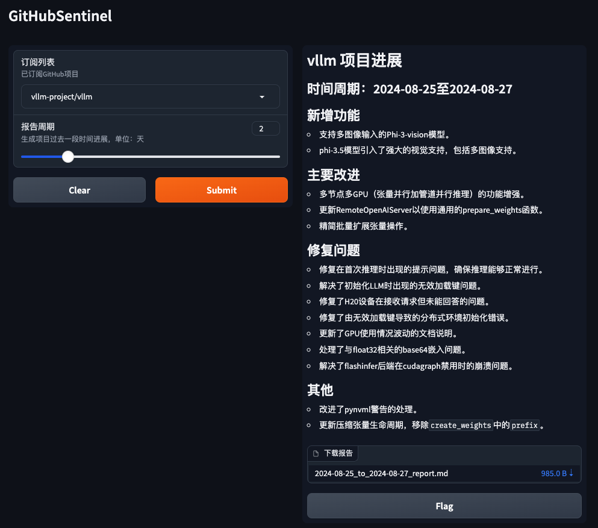

# GitHub Sentinel


<p align="center">
    <br> English | <a href="README.md">中文</a>
</p>

GitHub Sentinel is an open-source tool AI Agent designed for developers and project managers. It automatically retrieves and aggregates updates from subscribed GitHub repositories on a regular basis (daily/weekly). Key features include subscription management, update retrieval, notification system, and report generation.

## Features
- Subscription management
- Update retrieval
- Notification system
- Report generation

## Getting Started

### 1. Install Dependencies

First, install the required dependencies:

```sh
pip install -r requirements.txt
```

### 2. Configure the Application

Edit the `config.json` file to set up your GitHub token, Email settings(e.g.Tencent Exmail), subscription file, update settings and LLM settings(both support OpenAI GPT API and Ollama REST API so far):


```json
{
    "github_token": "your_github_token",
    "email":  {
        "smtp_server": "smtp.exmail.qq.com",
        "smtp_port": 465,
        "from": "from_email@example.com",
        "password": "your_email_password",
        "to": "to_email@example.com"
    },
    "slack_webhook_url": "your_slack_webhook_url",
    "subscriptions_file": "subscriptions.json",
    "github_progress_frequency_days": 1,
    "github_progress_execution_time":"08:00",
    "llm": {
        "model_type": "openai",
        "openai_model_name": "gpt-4o-mini",
        "ollama_model_name": "llama3",
        "ollama_api_url": "http://localhost:11434/api/chat"
    }
}

```
**For security reasons:** It is recommended to configure the GitHub Token and Email Password using environment variables to avoid storing sensitive information in plain text, as shown below:

```shell
# GitHub
export GITHUB_TOKEN="github_pat_xxx"
# Email
export EMAIL_PASSWORD="password"
```

#### Ollama: Installation and Deployment

[Ollama Installation and Deployment](docs/ollama.md)

### 3. How to Run

GitHub Sentinel supports the following three modes of operation:

#### A. Run as a Command-Line Tool

You can interactively run the application from the command line:

```sh
python src/command_tool.py
```

In this mode, you can manually enter commands to manage subscriptions, retrieve updates, and generate reports.

#### B. Run as a Background Service

To run the application as a background service (daemon), it will automatically update according to the configured schedule.

You can use the daemon management script [daemon_control.sh](daemon_control.sh) to start, check the status, stop, and restart:

1. Start the service:

    ```sh
    $ ./daemon_control.sh start
    Starting DaemonProcess...
    DaemonProcess started.
    ```

   - This will launch [./src/daemon_process.py], generating reports periodically as set in `config.json`, and sending emails.
   - Service logs will be saved to `logs/DaemonProcess.log`, with historical logs also appended to `logs/app.log`.

2. Check the service status:

    ```sh
    $ ./daemon_control.sh status
    DaemonProcess is running.
    ```

3. Stop the service:

    ```sh
    $ ./daemon_control.sh stop
    Stopping DaemonProcess...
    DaemonProcess stopped.
    ```

4. Restart the service:

    ```sh
    $ ./daemon_control.sh restart
    Stopping DaemonProcess...
    DaemonProcess stopped.
    Starting DaemonProcess...
    DaemonProcess started.
    ```

#### C. Run as a Gradio Server

To run the application with a Gradio interface, allowing users to interact with the tool via a web interface:

```sh
python src/gradio_server.py
```



- This will start a web server on your machine, allowing you to manage subscriptions and generate reports through a user-friendly interface.
- By default, the Gradio server will be accessible at `http://localhost:7860`, but you can share it publicly if needed.

## Contributing

Contributions are what make the open source community such an amazing place to learn, inspire, and create. Any contributions you make are greatly appreciated. If you have any suggestions or feature requests, please open an issue first to discuss what you would like to change.

<a href='https://github.com/repo-reviews/repo-reviews.github.io/blob/main/create.md' target="_blank"></a>

## License

This project is licensed under the terms of the Apache-2.0 License . See the [LICENSE](LICENSE) file for details.

## Contact

Django Peng - pjt73651@email.com

Project Link: https://github.com/DjangoPeng/GitHubSentinel
