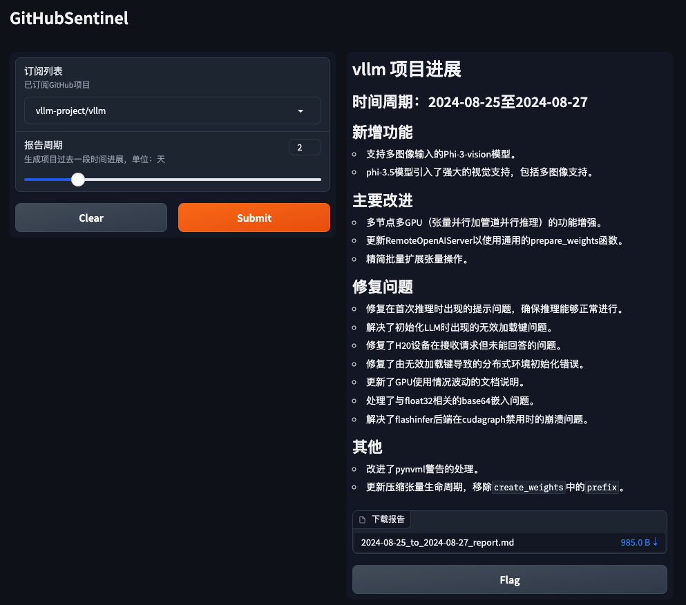

# GitHub Sentinel


<p align="center">
    <br> <a href="README-EN.md">English</a> | 中文
</p>

GitHub Sentinel 是一个开源的工具 AI 代理，专为开发人员和项目经理设计。它会定期（每日/每周）自动从订阅的 GitHub 仓库中检索和汇总更新。主要功能包括订阅管理、更新检索、通知系统和报告生成。

## 功能
- 订阅管理
- 更新检索
- 通知系统
- 报告生成

## 快速开始

### 1. 安装依赖

首先，安装所需的依赖项：

```sh
pip install -r requirements.txt
```

### 2. 配置应用

编辑 `config.json` 文件，以设置您的 GitHub Token、Email 设置（以腾讯企微邮箱为例）、订阅文件、更新设置，以及大模型服务配置（支持 OpenAI GPT API 和 Ollama 私有化大模型服务）：

```json
{
    "github_token": "your_github_token",
    "email":  {
        "smtp_server": "smtp.exmail.qq.com",
        "smtp_port": 465,
        "from": "from_email@example.com",
        "password": "your_email_password",
        "to": "to_email@example.com"
    },
    "slack_webhook_url": "your_slack_webhook_url",
    "subscriptions_file": "subscriptions.json",
    "github_progress_frequency_days": 1,
    "github_progress_execution_time":"08:00",
    "llm": {
        "model_type": "openai",
        "openai_model_name": "gpt-4o-mini",
        "ollama_model_name": "llama3",
        "ollama_api_url": "http://localhost:11434/api/chat"
    }
}
```

**出于安全考虑:** GitHub Token 和 Email Password 的设置均支持使用环境变量进行配置，以避免明文配置重要信息，如下所示：

```shell
# Github
export GITHUB_TOKEN="github_pat_xxx"
# Email
export EMAIL_PASSWORD="password"
```

#### Ollama 安装与配置


[Ollama 安装部署与服务发布](docs/ollama.md)


### 3. 如何运行

GitHub Sentinel 支持以下三种运行方式：

#### A. 作为命令行工具运行

您可以从命令行交互式地运行该应用：

```sh
python src/command_tool.py
```

在此模式下，您可以手动输入命令来管理订阅、检索更新和生成报告。

#### B. 作为后台服务运行

要将该应用作为后台服务（守护进程）运行，它将根据相关配置定期自动更新。

您可以直接使用守护进程管理脚本 [daemon_control.sh](daemon_control.sh) 来启动、查询状态、关闭和重启：

1. 启动服务：

    ```sh
    $ ./daemon_control.sh start
    Starting DaemonProcess...
    DaemonProcess started.
    ```

   - 这将启动[./src/daemon_process.py]，按照 `config.json` 中设置的更新频率和时间点定期生成报告，并发送邮件。
   - 本次服务日志将保存到 `logs/DaemonProcess.log` 文件中。同时，历史累计日志也将同步追加到 `logs/app.log` 日志文件中。

2. 查询服务状态：

    ```sh
    $ ./daemon_control.sh status
    DaemonProcess is running.
    ```

3. 关闭服务：

    ```sh
    $ ./daemon_control.sh stop
    Stopping DaemonProcess...
    DaemonProcess stopped.
    ```

4. 重启服务：

    ```sh
    $ ./daemon_control.sh restart
    Stopping DaemonProcess...
    DaemonProcess stopped.
    Starting DaemonProcess...
    DaemonProcess started.
    ```
    
#### C. 作为 Gradio 服务器运行

要使用 Gradio 界面运行应用，允许用户通过 Web 界面与该工具交互：

```sh
python src/gradio_server.py
```



- 这将在您的机器上启动一个 Web 服务器，允许您通过用户友好的界面管理订阅和生成报告。
- 默认情况下，Gradio 服务器将可在 `http://localhost:7860` 访问，但如果需要，您可以公开共享它。

## 贡献

贡献是使开源社区成为学习、激励和创造的惊人之处。非常感谢你所做的任何贡献。如果你有任何建议或功能请求，请先开启一个议题讨论你想要改变的内容。

<a href='https://github.com/repo-reviews/repo-reviews.github.io/blob/main/create.md' target="_blank"></a>

## 许可证

该项目根据Apache-2.0许可证的条款进行许可。详情请参见[LICENSE](LICENSE)文件。

## 联系

Django Peng - pjt73651@email.com

项目链接: https://github.com/DjangoPeng/GitHubSentinel

