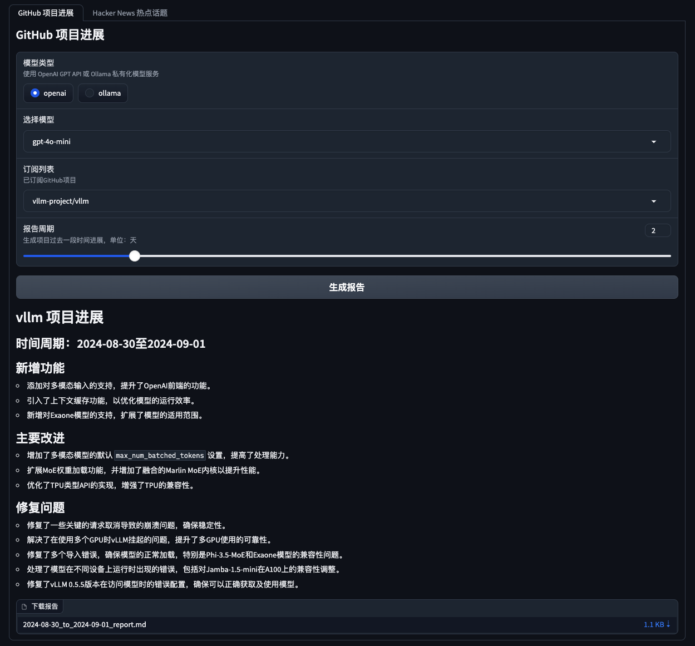
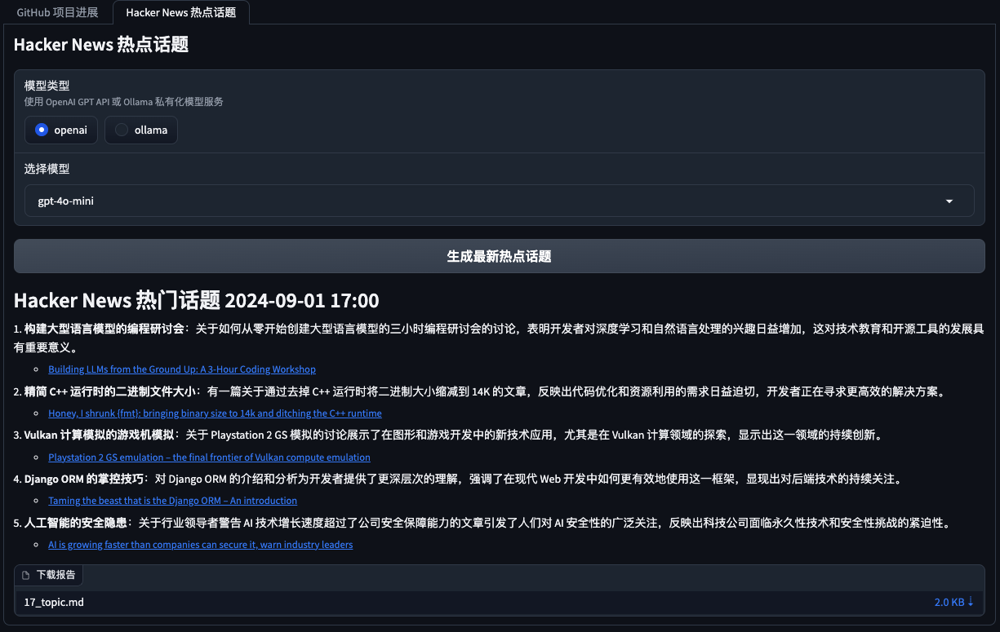
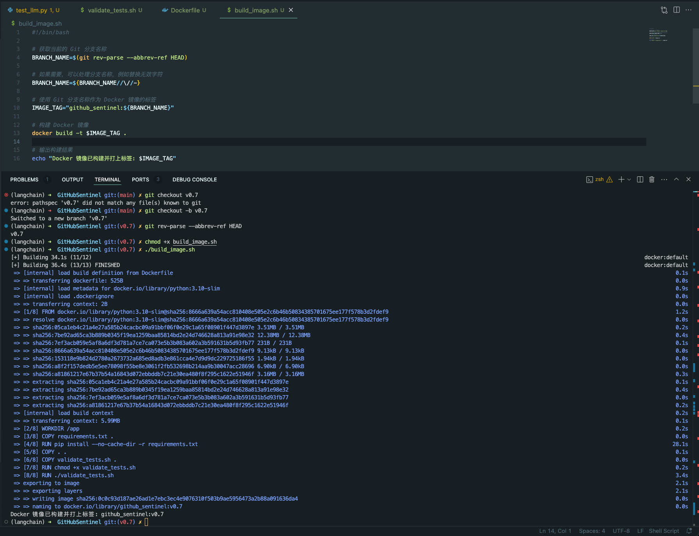

# GitHub Sentinel


<p align="center">
    <br> <a href="README-EN.md">English</a> | 中文
</p>

## 目录

- [GitHub Sentinel](#github-sentinel)
- [主要功能](#主要功能)
- [产品截图](#产品截图)
- [快速开始](#快速开始)
  - [1. 安装依赖](#1-安装依赖)
  - [2. 配置应用](#2-配置应用)
  - [3. 如何运行](#3-如何运行)
    - [A. 作为命令行工具运行](#a-作为命令行工具运行)
    - [B. 作为后台服务运行](#b-作为后台服务运行)
    - [C. 作为 Gradio 服务器运行](#c-作为-gradio-服务器运行)
- [Ollama 安装与服务发布](#Ollama-安装与服务发布)
- [单元测试](#单元测试)
  - [单元测试和验证脚本 `validate_tests.sh`](#单元测试和验证脚本-validate_testssh)
    - [用途](#用途)
    - [功能](#功能)
- [使用 Docker 构建与验证](#使用-docker-构建与验证)
  - [1. `Dockerfile`](#1-dockerfile)
    - [用途](#用途)
    - [关键步骤](#关键步骤)
  - [2. `build_image.sh`](#2-build_imagesh)
    - [用途](#用途)
    - [功能](#功能)
- [贡献](#贡献)
- [许可证](#许可证)
- [联系](#联系)


GitHub Sentinel 是专为大模型（LLMs）时代打造的智能信息检索和高价值内容挖掘 `AI Agent`。它面向那些需要高频次、大量信息获取的用户，特别是开源爱好者、个人开发者和投资人等。


### 主要功能

- **订阅管理**：轻松管理和跟踪您关注的 GitHub 仓库。
- **更新检索**：自动检索并汇总订阅仓库的最新动态，包括提交记录、问题和拉取请求。
- **通知系统**：通过电子邮件等方式，实时通知订阅者项目的最新进展。
- **报告生成**：基于检索到的更新生成详细的项目进展报告，支持多种格式和模板，满足不同需求。
- **多模型支持**：结合 OpenAI 和 Ollama 模型，生成自然语言项目报告，提供更智能、精准的信息服务。
- **定时任务**：支持以守护进程方式执行定时任务，确保信息更新及时获取。
- **图形化界面**：基于 Gradio 实现了简单易用的 GUI 操作模式，降低使用门槛。
- **容器化**：项目支持 Docker 构建和容器化部署，便于在不同环境中快速部署和运行。
- **持续集成**：实现了完备的单元测试，便于进一步配置生产级 CI/CD 流程，确保项目的稳定性和高质量交付。

GitHub Sentinel 不仅能帮助用户自动跟踪和分析 `GitHub 开源项目` 的最新动态，还能快速扩展到其他信息渠道，如 `Hacker News` 的热门话题，提供更全面的信息挖掘与分析能力。

### 产品截图

**GitHub 项目进度跟踪与总结**



**Hacker News 热门技术话题挖掘**



## 快速开始

### 1. 安装依赖

首先，安装所需的依赖项：

```sh
pip install -r requirements.txt
```

### 2. 配置应用

编辑 `config.json` 文件，以设置您的 GitHub Token、Email 设置（以腾讯企微邮箱为例）、订阅文件、更新设置，大模型服务配置（支持 OpenAI GPT API 和 Ollama 私有化大模型服务）,以及自动检索和生成的报告类型（GitHub项目进展， Hacker News 热门话题和前沿技术趋势）：

```json
{
    "github": {
        "token": "your_github_token",
        "subscriptions_file": "subscriptions.json",
        "progress_frequency_days": 1,
        "progress_execution_time": "08:00"
    },
    "email":  {
        "smtp_server": "smtp.exmail.qq.com",
        "smtp_port": 465,
        "from": "from_email@example.com",
        "password": "your_email_password",
        "to": "to_email@example.com"
    },
    "llm": {
        "model_type": "ollama",
        "openai_model_name": "gpt-4o-mini",
        "ollama_model_name": "llama3",
        "ollama_api_url": "http://localhost:11434/api/chat"
    },
    "report_types": [
        "github",
        "hacker_news_hours_topic",
        "hacker_news_daily_report"
    ],
    "slack": {
        "webhook_url": "your_slack_webhook_url"
    }
}
```

**出于安全考虑:** GitHub Token 和 Email Password 的设置均支持使用环境变量进行配置，以避免明文配置重要信息，如下所示：

```shell
# Github
export GITHUB_TOKEN="github_pat_xxx"
# Email
export EMAIL_PASSWORD="password"
```


### 3. 如何运行

GitHub Sentinel 支持以下三种运行方式：

#### A. 作为命令行工具运行

您可以从命令行交互式地运行该应用：

```sh
python src/command_tool.py
```

在此模式下，您可以手动输入命令来管理订阅、检索更新和生成报告。

#### B. 作为后台服务运行

要将该应用作为后台服务（守护进程）运行，它将根据相关配置定期自动更新。

您可以直接使用守护进程管理脚本 [daemon_control.sh](daemon_control.sh) 来启动、查询状态、关闭和重启：

1. 启动服务：

    ```sh
    $ ./daemon_control.sh start
    Starting DaemonProcess...
    DaemonProcess started.
    ```

   - 这将启动[./src/daemon_process.py]，按照 `config.json` 中设置的更新频率和时间点定期生成报告，并发送邮件。
   - 本次服务日志将保存到 `logs/DaemonProcess.log` 文件中。同时，历史累计日志也将同步追加到 `logs/app.log` 日志文件中。

2. 查询服务状态：

    ```sh
    $ ./daemon_control.sh status
    DaemonProcess is running.
    ```

3. 关闭服务：

    ```sh
    $ ./daemon_control.sh stop
    Stopping DaemonProcess...
    DaemonProcess stopped.
    ```

4. 重启服务：

    ```sh
    $ ./daemon_control.sh restart
    Stopping DaemonProcess...
    DaemonProcess stopped.
    Starting DaemonProcess...
    DaemonProcess started.
    ```

#### C. 作为 Gradio 服务器运行

要使用 Gradio 界面运行应用，允许用户通过 Web 界面与该工具交互：

```sh
python src/gradio_server.py
```


- 这将在您的机器上启动一个 Web 服务器，允许您通过用户友好的界面管理订阅和生成报告。
- 默认情况下，Gradio 服务器将可在 `http://localhost:7860` 访问，但如果需要，您可以公开共享它。


## Ollama 安装与服务发布

Ollama 是一个私有化大模型管理工具，支持本地和容器化部署，命令行交互和 REST API 调用。

关于 Ollama 安装部署与私有化大模型服务发布的详细说明，请参考[Ollama 安装部署与服务发布](docs/ollama.md)。

### Ollama 简要官方安装

要在 GitHub Sentinel 中使用 Ollama 调用私有化大模型服务，请按照以下步骤进行安装和配置：

1. **安装 Ollama**：
   请根据 Ollama 的官方文档下载并安装 Ollama 服务。Ollama 支持多种操作系统，包括 Linux、Windows 和 macOS。

2. **启动 Ollama 服务**：
   安装完成后，通过以下命令启动 Ollama 服务：

   ```bash
   ollama serve
   ```

   默认情况下，Ollama API 将在 `http://localhost:11434` 运行。

3. **配置 Ollama 在 GitHub Sentinel 中使用**：
   在 `config.json` 文件中，配置 Ollama API 的相关信息：

   ```json
   {
       "llm": {
           "model_type": "ollama",
           "ollama_model_name": "llama3",
           "ollama_api_url": "http://localhost:11434/api/chat"
       }
   }
   ```

4. **验证配置**：
   使用以下命令启动 GitHub Sentinel 并生成报告，以验证 Ollama 配置是否正确：

   ```bash
   python src/command_tool.py
   ```

   如果配置正确，您将能够通过 Ollama 模型生成报告。


## 单元测试

为了确保代码的质量和可靠性，GitHub Sentinel 使用了 `unittest` 模块进行单元测试。关于 `unittest` 及其相关工具（如 `@patch` 和 `MagicMock`）的详细说明，请参考 [单元测试详细说明](docs/unit_test.md)。

### 单元测试和验证脚本 `validate_tests.sh`

#### 用途
`validate_tests.sh` 是一个用于运行单元测试并验证结果的 Shell 脚本。它在 Docker 镜像构建过程中被执行，以确保代码的正确性和稳定性。

#### 功能
- 脚本运行所有单元测试，并将结果输出到 `test_results.txt` 文件中。
- 如果测试失败，脚本会输出测试结果并导致 Docker 构建失败。
- 如果所有测试通过，脚本会继续构建过程。


## 使用 Docker 构建与验证

为了便于在各种环境中构建和部署 GitHub Sentinel 项目，我们提供了 Docker 支持。该支持包括以下文件和功能：

### 1. `Dockerfile`

#### 用途
`Dockerfile` 是用于定义如何构建 Docker 镜像的配置文件。它描述了镜像的构建步骤，包括安装依赖、复制项目文件、运行单元测试等。

#### 关键步骤
- 使用 `python:3.10-slim` 作为基础镜像，并设置工作目录为 `/app`。
- 复制项目的 `requirements.txt` 文件并安装 Python 依赖。
- 复制项目的所有文件到容器，并赋予 `validate_tests.sh` 脚本执行权限。
- 在构建过程中执行 `validate_tests.sh` 脚本，以确保所有单元测试通过。如果测试失败，构建过程将中止。
- 构建成功后，将默认运行 `src/main.py` 作为容器的入口点。

### 2. `build_image.sh`

#### 用途
`build_image.sh` 是一个用于自动构建 Docker 镜像的 Shell 脚本。它从当前的 Git 分支获取分支名称，并将其用作 Docker 镜像的标签，便于在不同分支上生成不同的 Docker 镜像。

#### 功能
- 获取当前的 Git 分支名称，并将其用作 Docker 镜像的标签。
- 使用 `docker build` 命令构建 Docker 镜像，并使用当前 Git 分支名称作为标签。

#### 使用示例
```bash
chmod +x build_image.sh
./build_image.sh
```



通过这些脚本和配置文件，确保在不同的开发分支中，构建的 Docker 镜像都是基于通过单元测试的代码，从而提高了代码质量和部署的可靠性。

## 贡献

贡献是使开源社区成为学习、激励和创造的惊人之处。非常感谢你所做的任何贡献。如果你有任何建议或功能请求，请先开启一个议题讨论你想要改变的内容。

<a href='https://github.com/repo-reviews/repo-reviews.github.io/blob/main/create.md' target="_blank"></a>

## 许可证

该项目根据 Apache-2.0 许可证的条款进行许可。详情请参见 [LICENSE](LICENSE) 文件。

## 联系

Django Peng - pjt73651@email.com

项目链接: https://github.com/DjangoPeng/GitHubSentinel
